# Deliverable 1 — System Architecture

**Status:** Draft v0.1
**Owner:** Platform
**Last updated:** 2026-05-21
**Implements:** [`prompt.md`](../../prompt.md) §1

This document is the canonical architecture reference for StudyForge AI. It precedes the database schema, API design, and AI-pipeline specs, and is referenced by every subsequent deliverable.

---

## (a) Design rationale

StudyForge AI is a **multi-tenant, async-first, RAG-grounded** learning platform with three load-bearing constraints baked into every layer:

1. **Cost must approach zero per free student.** The platform must remain economically viable while charging the average student nothing. This drives a **free-tier-first LLM router**, aggressive **prompt + semantic + course-shared caching**, and **batch APIs** for non-urgent generation. Everything paid is opt-in (Pro), supplier-funded (BYOK), or institution-funded (LTI license).
2. **Source-grounded responses are non-negotiable.** Uncited model output is a defect, not a feature toggle. The architecture treats citations as a first-class data type and blocks responses that lack them at the response layer.
3. **Uploaded content is untrusted.** Code/notebooks may carry prompt injections, malware, copyright violations, or PII. The pipeline therefore runs a **safety stage before embedding** and isolates all code execution inside **gVisor/Firecracker sandboxes** with no network.

The shape of the system follows directly from these constraints:

- A **gateway** (NestJS) owns auth, validation, rate-limits, and orchestration. It never talks to LLM providers — every call goes through `packages/llm-router`.
- A **Python AI worker fleet** (FastAPI + Celery) handles parsing, embedding, and generation because the Python ML ecosystem dominates here. Each agent is an independent Celery task with a typed input/output schema and a golden-set eval.
- **Postgres + pgvector + Redis + Meilisearch** form the data plane. We deliberately keep vector storage in Postgres in dev (and pluggably in Pinecone in prod) to avoid a parallel index management surface for small tenants.
- **Sandbox-runner** is a separate service so the blast radius of a sandbox escape is contained outside the application network.
- **Realtime** is split: SSE for one-way LLM streams (simplest possible), WebSockets only for the bidirectional surfaces (chat, live pipeline progress).
- **Observability** uses OpenTelemetry traces end-to-end so that a single tutor turn — gateway → router → cache → provider → response — produces one continuous trace. Without that, optimising cost or latency is guesswork.

The rest of this document specifies the component topology, the data flows, the eight critical sequences, the failure-mode matrix, and the multi-region/DR posture. Trade-offs explicitly rejected appear at the end.

---

## (b) Architecture artifacts

### 1. Component diagram

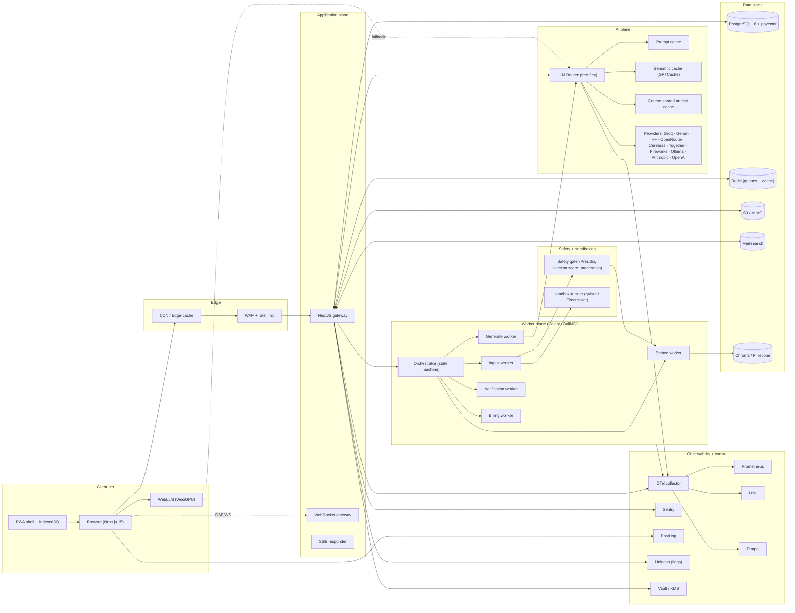

### 2. Data flow diagrams

#### 2.1 Upload → ingest → embed → index

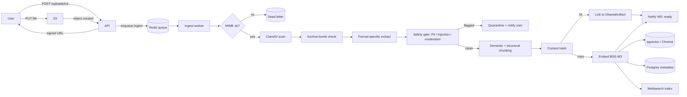

#### 2.2 Chat query → RAG → stream

```mermaid
flowchart LR
  U[User] -->|"WS: tutor.ask"| API
  API --> CLS[Complexity classifier]
  CLS --> POLICY[Tier policy + quota check]
  POLICY -->|denied| DEGRADE[Downshift model]
  POLICY -->|ok| HYB[Hybrid retrieval: dense + BM25 + RRF]
  DEGRADE --> HYB
  HYB --> RERANK[BGE-Reranker]
  RERANK --> SEM{Semantic cache hit?}
  SEM -->|yes| RET[Return cached + cite]
  SEM -->|no| ROUTE[LLM router]
  ROUTE --> PCACHE[Prompt cache lookup]
  PCACHE --> PROV[Provider call - streaming]
  PROV --> CITE[Citation enforcement]
  CITE -->|missing| REFUSE[Refuse w/ suggestions]
  CITE -->|ok| STREAM[SSE → user]
  STREAM --> LEDGER[Cost ledger update]
  RET --> STREAM
```

#### 2.3 Quiz generation lifecycle

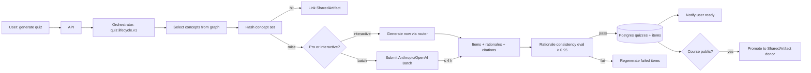

#### 2.4 Billing / metering

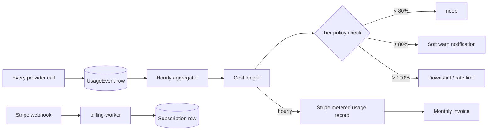

### 3. Sequence diagrams — the eight critical paths

#### 3.1 Upload (resumable)

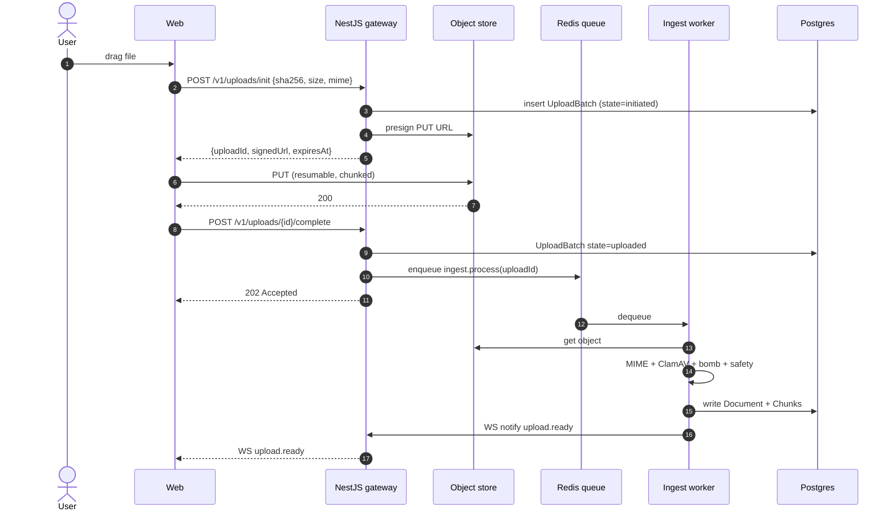

#### 3.2 Tutor chat (streaming, cited)

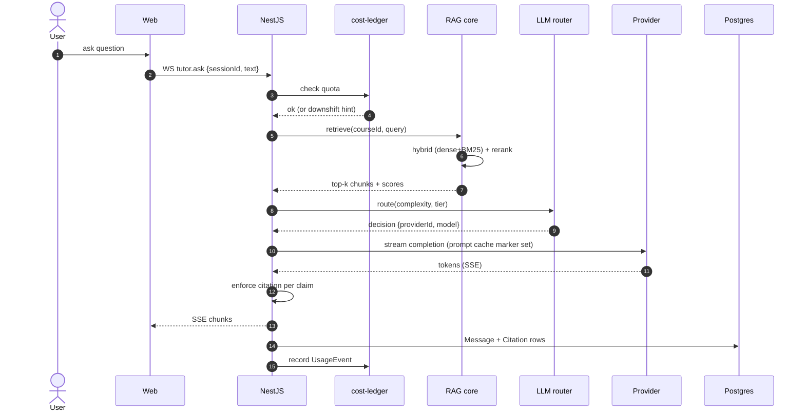

#### 3.3 Roadmap generation

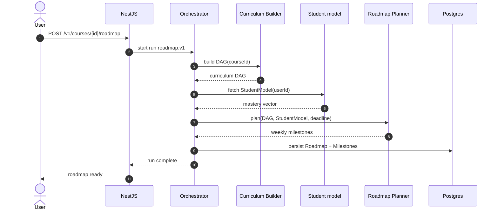

#### 3.4 Quiz attempt

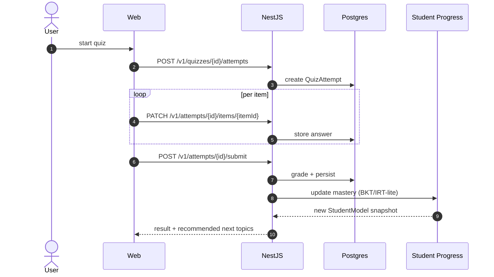

#### 3.5 Sandboxed code run

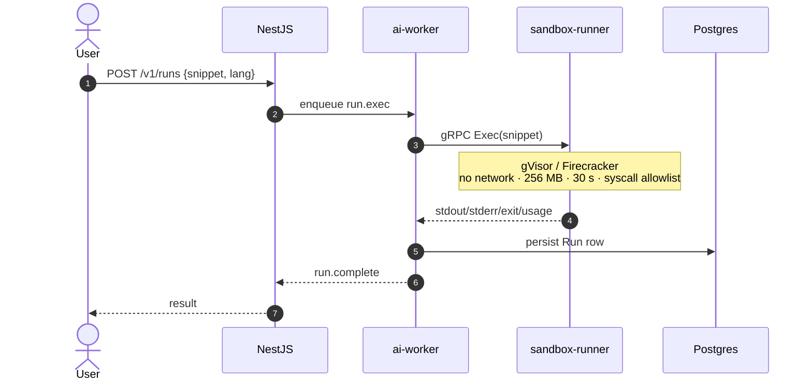

#### 3.6 GDPR erasure (DSAR Art. 17)

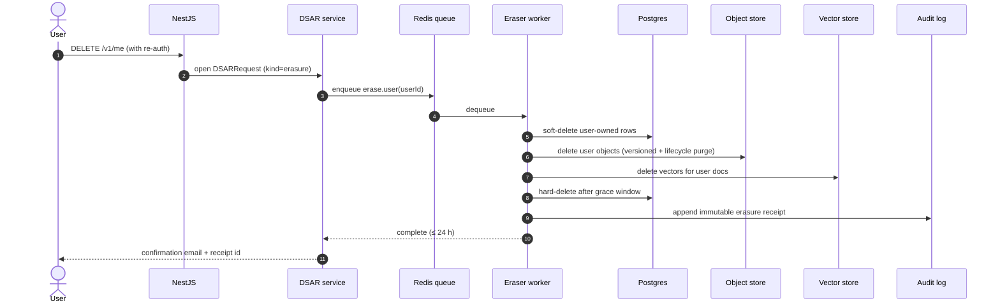

#### 3.7 LTI 1.3 launch (Canvas → StudyForge)

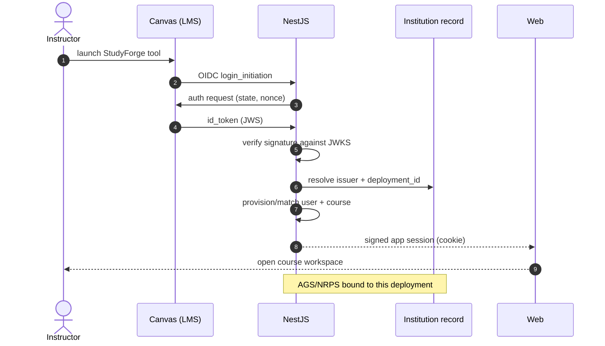

#### 3.8 BYOK key flow

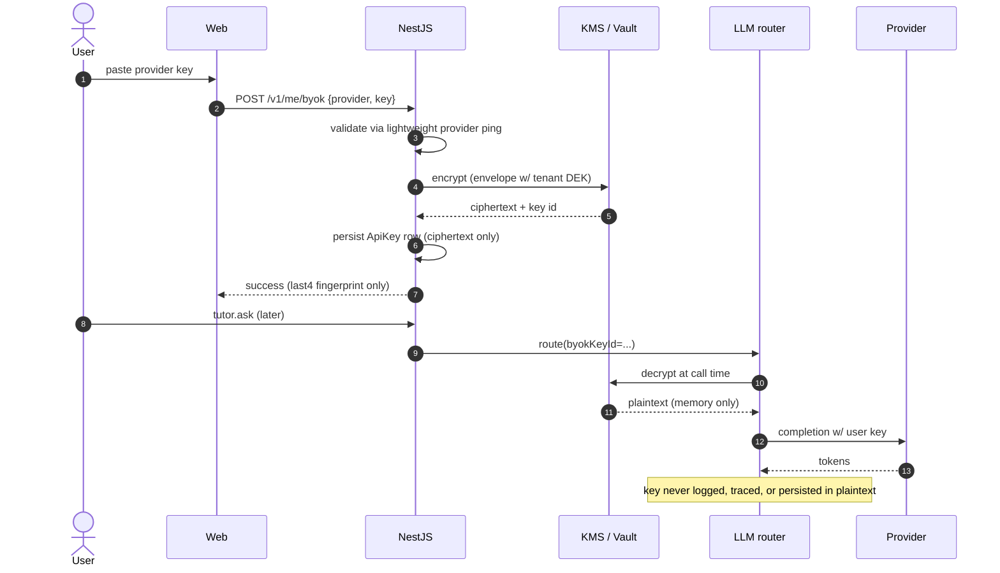

### 4. Failure-mode matrix

| Failure | Detection | Default response | Retry | DLQ | Degradation |
|---|---|---|---|---|---|
| Provider 5xx / timeout | Circuit breaker per-provider sliding window | Failover to next free provider | exp backoff, 3 tries | n/a | downshift class |
| Provider quota exhausted | Pre-flight `ProviderQuota` row | Skip provider in router | n/a | n/a | downshift to next free |
| Redis unavailable | health probe + connection failure | refuse new background jobs; in-flight degrade | exp backoff | n/a | API stays up, jobs deferred |
| Postgres primary down | LB / patroni failover | reads from replica if possible | retry with jitter | n/a | writes 503 with Retry-After |
| Object store error | upload HEAD | mark UploadBatch failed | 5 tries | dead-letter | user re-uploads (resumable) |
| Sandbox timeout / OOM | enforced by runtime | mark Run failed | none (idempotent re-submit) | n/a | user fix-and-retry |
| Embedding model OOM | worker process metric | downscale batch size | yes | after 3 fails | switch to remote BGE endpoint |
| Citation enforcement fails | response post-processor | refuse + suggest related | n/a | n/a | user reformulates |
| Stripe webhook unverified | signature mismatch | 400 + log | none | yes | manual reconciliation runbook |
| RAG quality regression (Ragas) | nightly eval job | block deploy on PR | n/a | n/a | rollback to last green prompt version |
| Cost cap breached (tenant) | hourly aggregator | hard cap on paid models | n/a | n/a | route only to free providers |
| ClamAV positive | scan result | quarantine + flag uploader | n/a | yes (review) | user notified |
| Prompt injection signal | safety gate score > threshold | strip and tag content channel | n/a | yes (review) | retrieval proceeds with untrusted tag |

All workers use **idempotency keys** (`Job.idempotency_key`) keyed on inputs so retries never produce duplicate side effects.

### 5. Multi-region and DR posture

| Concern | Posture |
|---|---|
| Primary region | One region per data-residency zone (e.g. `us-east-1`, `eu-west-1`). Per-tenant residency stored on `Tenant.region`. |
| Secondary region | Warm standby for compute (Helm-deploy-on-failover), cross-region read replica for Postgres, S3 cross-region replication for upload bucket. |
| Postgres backups | Continuous WAL archiving + nightly snapshot; **PITR window: 7 days**. |
| RPO | ≤ 15 minutes (WAL ship interval). |
| RTO | ≤ 1 hour (Helm deploy + DNS cutover + replica promotion). |
| Object store | Versioned bucket + cross-region replication; lifecycle rules expire DSAR-erased objects in 24 h. |
| Vector store | Re-buildable from Postgres `Chunk` + embedding cache; treated as a tertiary backup, not gold copy. |
| Secrets | KMS keys regional, with cross-region wrapping for break-glass. |
| Restore drills | Quarterly: full restore into an isolated namespace, verified by smoke suite. |

## (c) Trade-offs explicitly rejected

| Rejected option | Reason |
|---|---|
| **A single monolithic service (Node only)** | The ML toolchain (PyMuPDF, PaddleOCR, Presidio, Ragas) is decisively Python; bridging via subprocess is fragile. NestJS + FastAPI split chosen. |
| **Direct provider SDK calls from controllers** | Couples business logic to vendor APIs and defeats the free-tier-first cost lever. Everything goes through `packages/llm-router`. |
| **Neo4j as primary store for the knowledge graph** | Adds an operational store for a feature that is easily expressed as two Postgres tables with proper indexes. Optional Neo4j mirror remains available for analytics. |
| **Pinecone as the dev default** | Cost during local development and increased CI complexity. Chroma in dev, Pinecone optional in prod. |
| **Synchronous file processing in the request path** | Breaks the 500 MB / 10-minute acceptance criterion and turns p95 latency into provider-dependent noise. All ingestion is async. |
| **WebSockets for LLM streaming** | Over-engineered for a one-way stream; SSE is simpler, proxy-friendly, and reconnects natively. WS retained only for bidirectional surfaces. |
| **One Kubernetes namespace per tenant** | Massive operational overhead. Tenancy is enforced at the row level (RLS) and the storage prefix; clusters stay shared. |
| **Hard-blocking free users on quota exhaustion** | Breaks the "free-by-default" principle. Free users always get an answer, even if from WebLLM or a smaller model. |
| **A single LLM provider with retries** | Concentration risk (rate limits, outages, price changes) and removes the free-tier cost lever. Free-first router is mandatory. |
| **Ad-hoc prompt edits in code** | Untestable and unrollback-able. All prompts live in `packages/llm-router/prompts` with a version and a golden-set eval. |
| **Allowing model output without citations as a soft warning** | Defeats the source-grounded principle. Citations are enforced at the response layer; missing citations cause refusal, not degradation. |
| **Running uploaded code inside the ai-worker container** | A single sandbox escape would compromise the embedding store and provider credentials. Hard separation into `sandbox-runner` is mandatory. |

---

## Next deliverables

- [Deliverable 2 — Monorepo layout](../../README.md#repository-layout) (implemented in this commit).
- [Deliverable 3 — Database schema (Prisma + pgvector)](./03-database-schema.md) (next).
- [Deliverable 4 — API design (OpenAPI 3.1)](./04-api-design.md).
- [Deliverable 5 — AI pipeline (multi-agent)](./05-ai-pipeline.md).
- See `prompt.md` for the full sequence.
