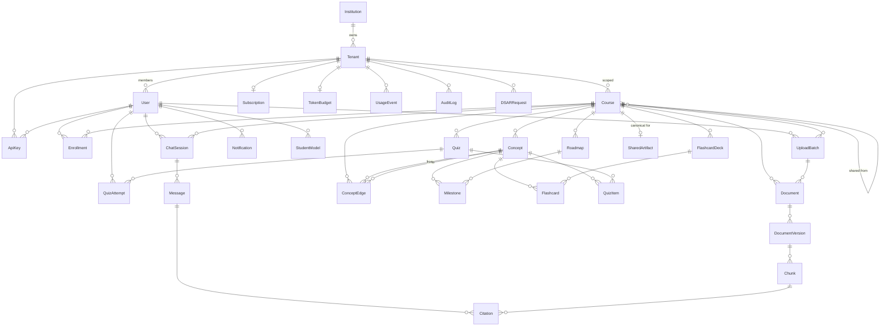

# Deliverable 3 — Database Schema

**Status:** Draft v0.1
**Owner:** Platform
**Last updated:** 2026-05-21
**Implements:** [`prompt.md`](../../prompt.md) §3
**Source of truth:** [`apps/api/prisma/schema.prisma`](../../apps/api/prisma/schema.prisma)
**Supplemental SQL:** [`apps/api/prisma/sql/`](../../apps/api/prisma/sql)

---

## (a) Design rationale

PostgreSQL 16 + `pgvector` is the entire data plane. We deliberately collapse the relational store, vector index, and full-text index into one cluster because:

- **Operational simplicity.** A single primary + read replica + WAL archive covers the dev / staging / small-tenant prod profile end-to-end. Pinecone is wired as an optional production swap, not a default.
- **Joinable retrieval.** Citations, retrieval scores, and source metadata must travel together. Keeping the vector column on the same row as document/page/chunk metadata avoids two-store consistency problems entirely.
- **Tenant isolation in depth.** Postgres row-level security gives a second line of defence after the application's tenant-id check. The app role cannot bypass it; the migration role and the GDPR eraser explicitly can.

Six load-bearing decisions shape the rest of the schema:

1. **Soft-delete + hard-delete worker.** Every user-visible entity carries `deletedAt`. A scheduled eraser hard-deletes after a 30-day grace, plus immediately on any active DSAR Art. 17 request. This keeps the "undo" UX cheap without keeping orphaned user data forever.
2. **DocumentVersion is the citation atom, not Document.** Re-uploading a lecture creates a new `DocumentVersion`. Generated artifacts (quiz items, flashcards, chat citations) point at the version they were grounded in, so regeneration diffs are explicit and citations never silently drift.
3. **`contentSha256` is the cache key.** Both BoundedContext caching and the course-shared artifact cache use a sha256 over **normalized extracted content** (not raw bytes). Two students who upload the same PDF — even with different filename or compression — get a cache hit.
4. **Cost ledger is append-only.** `UsageEvent` rows never update; aggregation is downstream. This gives Stripe metering, per-tenant cost dashboards, and the BYOK audit a single source of truth.
5. **Audit log is hash-chained at the database layer.** Tampering requires falsifying every subsequent row. The trigger refuses UPDATE/DELETE; a verifier function walks the chain and is paged on the first mismatch.
6. **Embeddings are 1024-dim, model-agnostic.** BGE-M3 is the default open model; Voyage-3 also outputs 1024 dims. Switching providers does not require re-shaping the column. A migration adds a new column only if the dimension changes.

The schema is partitioned into seven clusters: **tenancy & identity**, **courses & enrollment**, **ingestion**, **knowledge graph**, **roadmap**, **assessments** (flashcards + quizzes), **tutor chat**, **student modelling**, **notifications**, **billing & cost**, **BYOK & cache**, **compliance** (audit + DSAR + flags + jobs). Each cluster occupies a section of [`schema.prisma`](../../apps/api/prisma/schema.prisma).

---

## (b) ERD



The full attribute-level model is in `schema.prisma`. The diagram above is intentionally cluster-level — Mermaid ERDs become unreadable past ~30 entities and the goal is orientation, not exhaustive reference.

### Lookups & enums

| Enum | Values |
| --- | --- |
| `TenantKind` | personal · institutional |
| `DataRegion` | us · eu · ap |
| `TierName` | free · pro · byok · institutional |
| `UserRole` | student · instructor · admin · institution_admin |
| `CourseVisibility` | private · shared · public |
| `EnrollmentRole` | student · ta · instructor |
| `UploadState` | initiated · uploading · uploaded · scanning · extracting · embedding · ready · failed · quarantined |
| `ChunkModality` | text · code · table · formula · image_ocr · slide · notebook_cell |
| `ConceptEdgeKind` | prerequisite_of · related_to · example_of · derived_from · contradicts |
| `MilestoneStatus` | locked · pending · in_progress · completed · skipped |
| `QuizItemKind` | mcq · true_false · short_answer · coding · scenario |
| `AttemptState` | in_progress · submitted · graded · abandoned |
| `MessageRole` | user · assistant · system · tool |
| `NotificationKind` | upload_ready · milestone_due · quiz_due · weekly_digest · abuse_review · billing_warning · system |
| `NotificationChannel` | email · push · in_app |
| `NotificationState` | queued · sending · delivered · failed · read |
| `SubscriptionStatus` | trialing · active · past_due · canceled · unpaid · incomplete |
| `ExhaustPolicy` | downshift · rate_limit · block |
| `TierBilling` | platform · user · institution |
| `DSARKind` | access · erasure · portability · rectification |
| `DSARState` | received · in_progress · completed · rejected |
| `JobState` | queued · running · succeeded · failed · dead_letter |

### Vector & search columns

| Column | Type | Index |
| --- | --- | --- |
| `Chunk.embedding` | `vector(1024)` | HNSW (cosine, m=16, ef_construction=64) |
| `Concept.embedding` | `vector(1024)` | HNSW (cosine) |
| `CachedResponse.queryEmbedding` | `vector(1024)` | HNSW (cosine) |
| `Chunk.tsv` | `tsvector` | GIN, populated by trigger from `content` + `modality` |
| `Chunk.content` | `text` | GIN trigram (`gin_trgm_ops`) |
| `Concept.label` | `text` | GIN trigram |

Hybrid retrieval is **dense (HNSW cosine) + sparse (`tsv` GIN BM25) → RRF fusion → BGE-Reranker**. See [`rag-core`](../../packages/rag-core) and Deliverable 5 (AI pipeline).

### Soft-delete & GDPR lifecycle

- Every user-visible entity carries `deletedAt`.
- Application queries filter `WHERE "deletedAt" IS NULL` via Prisma middleware (Phase 1 work — wired in `apps/api/src/prisma`).
- Partial indexes over alive rows (see `03_search_indexes.sql`) keep the hot read paths the same shape as without soft delete.
- A nightly eraser job hard-deletes rows past their grace window. Grace defaults: 30 days for user content; 0 days when an active `DSARRequest{kind: erasure}` exists for the user.
- The eraser runs as the `studyforge_admin` role (BYPASSRLS) and writes one immutable `AuditLog` per erasure burst.
- S3 lifecycle policies and Chroma/Pinecone TTLs are configured to expire the corresponding objects/vectors in the same window.

### Tenant isolation (RLS)

- All tenant-scoped tables are `ENABLE ROW LEVEL SECURITY` + `FORCE ROW LEVEL SECURITY`.
- The single policy is `tenantId = app_current_tenant()`, where `app_current_tenant()` reads `current_setting('app.tenant_id', true)`.
- Application code wraps every request in a transaction that begins with `SET LOCAL app.tenant_id = $1`. Without that setting, every tenant-scoped query returns zero rows.
- Migrations and the GDPR eraser use a separate role with `BYPASSRLS`. CI fails any attempt to grant `BYPASSRLS` to the app role.

### Cost ledger integrity

- `UsageEvent` is insert-only; the application never updates a row.
- `costMicroUsd` is integer micro-USD (1e-6 USD). Float-free arithmetic across joins and dashboards.
- Per-tenant token budgets in `TokenBudget` are updated by a hourly aggregator (or BullMQ stream) — never by the request path.
- Stripe metered usage records are derived from `UsageEvent` via the `billing-worker` (Phase 4).

### Audit hash chain

- `AuditLog.hash = sha256(prevHash || canonical_json(row))`, computed by the `audit_log_seal` trigger.
- The trigger raises on `UPDATE` / `DELETE` so the log is append-only at the database layer.
- `audit_log_verify()` walks the chain and returns the first broken `id` or `NULL` if intact. A nightly job calls this; a non-null result pages on-call.
- Exports for compliance reviews are paginated reads keyed on `(tenantId, ts)`, with a chain-checkpoint per page.

### Provider quota tracking

- One row per provider in `ProviderQuota`. Sliding-window counters updated by the router on each call.
- `consecutiveFailures` drives the circuit breaker; `healthy = false` removes the provider from routing decisions until a probe succeeds.
- Free-tier providers each have a row; paid providers may or may not, depending on whether we track caps.

---

## (b·ii) How to apply

```bash
# 1. Make sure dev infra is up (postgres on :5432).
make up

# 2. Generate Prisma client + apply the Prisma migration.
make db-migrate

# 3. Apply supplemental SQL (extensions, vector indexes, tsv triggers, RLS, audit hash chain).
make db-setup
```

The supplemental SQL files are numbered and idempotent. Order matters: extensions must exist before vector indexes; RLS depends on the tables existing.

---

## (c) Trade-offs explicitly rejected

| Rejected | Reason |
| --- | --- |
| **Polymorphic `SharedArtifact` table with type+id columns** | Loses FK integrity. Picked: `Course.sharedFromCourseId` + per-artifact `courseId` so artifacts always belong to one canonical Course. |
| **Per-artifact `score` mastery in a join table** | Read amplification on every roadmap render. Mastery lives as JSONB on `StudentModel`, one row per user-course. |
| **Storing raw provider responses verbatim** | Costs orders of magnitude more storage than the citations + final text. We store text + token counts; full payloads land in S3 keyed by message id, opt-in. |
| **One Prisma schema per service** | Forces shared types into HTTP boundaries. The NestJS API owns Prisma; the Python worker reads/writes via the same Postgres with SQLModel definitions kept in lockstep via a generator. |
| **Auto-generated UUID v7 columns app-side** | Postgres `gen_random_uuid()` is sufficient; v7 sortable-uuid was tempting for index locality but `(tenantId, createdAt)` index ordering already gives us that. |
| **No soft delete, hard delete only** | Breaks the undo UX and complicates GDPR (which requires *eventual* hard deletion, not immediate). Soft delete + eraser gives both. |
| **`Citation` as a JSONB column on `Message`** | Loses queryability ("which chunks are most cited?") and breaks the FK from citations back to chunks. The audit cost of a join table is negligible. |
| **TimescaleDB hypertables for `UsageEvent`** | Useful only above ~100M rows/month. We defer until the volume justifies the operational overhead and revisit in Phase 5. |
| **Encrypting `ApiKey.cipher` at the application layer with a per-tenant DEK held in Redis** | Single point of failure if Redis is compromised. We use envelope encryption with the wrapping key in KMS / Vault. Plaintext exists only in the calling process's memory. |
| **`AuditLog.hash` as a generated column** | Postgres generated columns can't reference other rows. The chain requires reading the previous hash, so a trigger is required regardless. |

---

## Next deliverables

- [Deliverable 4 — API Design (OpenAPI 3.1)](./04-api-design.md) — exposes the entities defined here through versioned REST + tRPC.
- [Deliverable 5 — AI Pipeline (multi-agent)](./05-ai-pipeline.md) — agents read/write through Prisma + safety + RAG layers.
- [Deliverable 13 — Cost & Access Architecture](./13-cost-and-access.md) — uses `UsageEvent`, `TokenBudget`, `ProviderQuota`, `ApiKey`, `SharedArtifact`, `CachedResponse`.
