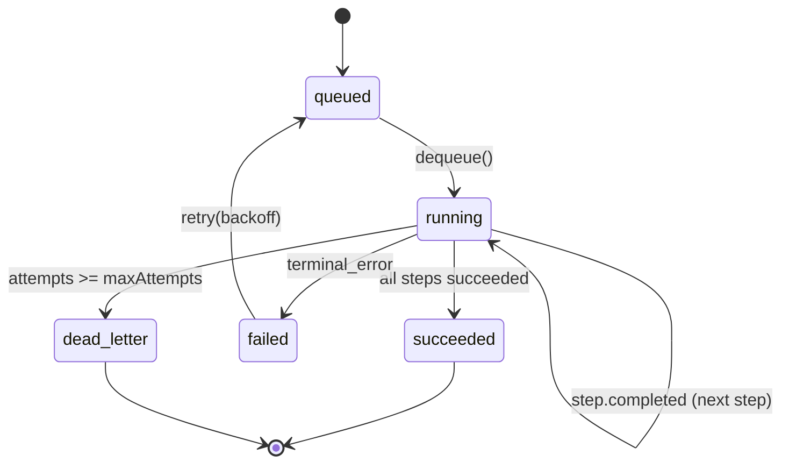

# Deliverable 5 — AI Pipeline (Multi-Agent)

**Status:** Draft v0.1
**Owner:** AI Platform
**Last updated:** 2026-05-21
**Implements:** [`prompt.md`](../../prompt.md) §5
**Source of truth:** [`apps/ai-worker/src/agents`](../../apps/ai-worker/src/agents) · [`apps/ai-worker/src/orchestrator`](../../apps/ai-worker/src/orchestrator)

---

## (a) Design rationale

Twelve specialised agents do the heavy work in StudyForge AI: parsing, safety filtering, semantic analysis, curriculum construction, roadmap planning, flashcard/quiz generation, diagram authoring, tutor chat, mastery estimation, notifications. Each is independently testable and independently versioned. None of them know about each other; only the **Orchestrator** does.

Four constraints shape the pipeline:

1. **Replayability is mandatory.** A run that succeeds on Tuesday must produce the same artifact ids on Thursday given the same inputs. This is what makes the course-shared artifact cache, the prompt eval harness, and the audit log usable. Concretely: every agent step is wrapped in a Postgres-persisted state machine with idempotency keys derived from the input hash.
2. **Citations are a structural constraint, not a guideline.** No agent that emits user-facing text can return without a non-empty citation set. The Tutor Agent and the Quiz Generator enforce this at the response-builder layer; failing the check produces a typed refusal — never a degraded answer. This rule survives prompt edits, model swaps, and provider failover.
3. **Prompts are versioned artifacts.** Each agent prompt has an id (`tutor.answer.v1`), a semver, a description, and a golden-set eval. CI fails when an agent ships without a passing eval. Changing the prompt means bumping the semver and adding a new entry in `packages/llm-router/prompts`; the old version stays callable until the new one's eval result meets the threshold.
4. **The router is the single chokepoint.** Agents never call provider SDKs. They take a `Router` instance and call `router.complete(...)`. This is what makes the free-tier-first cost policy enforceable: change the router, the entire fleet of agents inherits the change. It is also what makes prompt caching, semantic caching, and per-call cost telemetry universal.

The pipeline is built around three building blocks:

- **Contracts** (Pydantic v2): one input and one output type per agent, with strict validation.
- **Agent protocol**: every agent exposes `name`, `version`, `input_model`, `output_model`, and `run(input) -> output`.
- **Orchestrator state machine**: `Run` rows persist in Postgres (`Job` table from Deliverable 3) and carry an ordered list of `Step`s with deterministic ids. Each step's idempotency key is `sha256(agent.name || agent.version || canonical_json(input))`. Re-running a step with the same key returns the cached output without re-invoking the agent.

The Phase 0 implementation in this commit:

- Defines contracts for **all 12 agents** plus the run/step state machine.
- Implements the orchestrator with an **in-memory store** (Postgres-backed store lands in Phase 1 alongside Prisma integration in the ai-worker).
- Ships **one concrete agent — Tutor** — with the citation-enforcement refusal path wired and verified by a pytest case.
- Exposes `POST /v1/agents/runs` and `GET /v1/agents/runs/{id}` so the rest of the platform can already kick off and inspect runs.

The other 11 agents have contracts only at this stage; their implementations land in Phase 1–3 per the roadmap.

---

## (b) Architecture artifacts

### Agent catalog

| Agent | Module | Input → Output | Phase | Critical invariants |
|---|---|---|---|---|
| Document Parser | `agents.document_parser` | `RawFile` → `NormalizedBlocks` | 1 | Output blocks preserve `(page, slide, cell, charStart, charEnd)`; no inferred content. |
| Safety / PII | `agents.safety_pii` | `NormalizedBlocks` → `SanitizedBlocks` | 1 | Untrusted-document channel tagged; PII spans redacted with reversible tokens. |
| Semantic Analyzer | `agents.semantic_analyzer` | `SanitizedBlocks` → `ConceptTree` | 1 | Each concept carries at least one block reference. |
| Code Understanding | `agents.code_understanding` | `SourceFile`/`Notebook` → `AnnotatedCodeGraph` | 2 | AST nodes link back to source spans. |
| Curriculum Builder | `agents.curriculum_builder` | `ConceptTree` → `CurriculumDAG` | 2 | DAG acyclic; every edge has a `kind` ∈ `prerequisite_of` ∪ `related_to`. |
| Roadmap Planner | `agents.roadmap_planner` | `CurriculumDAG` + `StudentModel` → `WeeklyPlan` | 2 | Each milestone has effort minutes and a `weekIndex ≤ weeks`. |
| Flashcard Generator | `agents.flashcard_generator` | `Concepts` → `FlashcardSet` | 2 | Each card has ≥ 1 citation; cloze cards have a non-empty answer span. |
| Quiz Generator | `agents.quiz_generator` | `Concepts` + difficulty → `QuizBank` | 2 | Each item has a rationale and ≥ 1 citation; rationale-consistency eval ≥ 0.95. |
| Diagram Agent | `agents.diagram_agent` | `ConceptSubgraph` → `DiagramDSL` | 3 | Output is Mermaid or Cytoscape JSON; renderer parse must succeed. |
| Tutor Agent | `agents.tutor` | `Query` + `Session` → `GroundedResponse` | 1 | If no chunk supports the answer, return refusal (`refusal: true`, citations empty). |
| Student Progress | `agents.student_progress` | `Attempts` + `Interactions` → `StudentModelUpdate` | 2 | Mastery deltas bounded; per-concept attempt counters monotonic. |
| Notification Agent | `agents.notification_agent` | `Progress` + `Plan` → `ScheduledMessages` | 2 | Honours user quiet hours and locale. |

### Run / step state machine



A `Run` has:

- `id` (uuid) — stable across retries.
- `kind` (string) — e.g. `tutor.answer.v1`, `ingest.process.v1`.
- `state` (`queued | running | succeeded | failed | dead_letter`).
- `attempts`, `maxAttempts` — controls retry exhaustion.
- `idempotency_key` — `sha256(kind || canonical_json(input))`. Two runs with the same key collapse to the same row.
- `payload`, `result`, `error` — JSON.
- `steps[]` — ordered, each itself with the same state machine, so cross-agent orchestrations resume from the first non-terminal step.

A `Step` has:

- `name` (e.g. `parse → safety → semantic`)
- `agent_name`, `agent_version`
- `input`, `output`, `error`
- `state` (same enum as `Run`).
- `attempts`, `idempotency_key` (= sha256 of agent + version + canonical input).

This is the durable execution model. The Phase 0 store keeps runs in memory; Phase 1 swaps in a Postgres-backed implementation that reuses the `Job` table from Deliverable 3.

### Per-step idempotency

```python
key = sha256(
    agent.name.encode()
    + agent.version.encode()
    + canonical_json(input).encode()
).hexdigest()
```

If the same `(run_id, step_name, key)` is invoked twice, the second invocation returns the stored output without re-running the agent. This is what makes:

- Retries safe — the orchestrator can crash mid-pipeline and resume cleanly.
- Course-shared artifact cache work — two courses with the same `contentSha256` collapse to one execution.
- Eval harness deterministic — golden-set runs are exactly reproducible.

### Citation enforcement (Tutor + Quiz agents)

```text
post-LLM response → split into claims by sentence boundaries
                  → for each claim:
                       if any retrieved chunk supports it (similarity ≥ θ): attach citation
                       else: drop the claim and mark response as refusal
                  → if response has zero supported claims: return Refusal()
```

`Refusal` is a typed output: `{ refusal: true, text: "I could not find this in your materials.", suggestions: [...] }`. The endpoint layer maps it to a structured SSE `event: error` with `code: citation.missing` — never a 5xx, never a silent degradation.

### Prompt registry

All prompts live in `packages/llm-router/src/prompts/index.ts` (already scaffolded in Deliverable 2). Each definition has:

```ts
export interface PromptDefinition {
  id: string;        // e.g. "tutor.answer.v1"
  version: string;   // semver
  description: string;
  system: string;
}
```

Rules:

1. **No prompt edits in place.** Bump the version. Old version stays callable until the new one's eval passes.
2. **Every prompt has a golden set.** Stored in `packages/eval-harness/golden/<prompt_id>/<version>/`.
3. **CI gate.** A PR cannot merge if the changed prompt's golden eval falls below the threshold (Ragas faithfulness ≥ 0.85, quiz rationale-consistency ≥ 0.95).
4. **A/B routing.** A prompt can declare a fallback (e.g. `tutor.answer.v1` rolls over to `tutor.answer.v2` for 10% of traffic when the flag is on). Decision recorded in `UsageEvent.agent`.

### Telemetry per call

Every agent invocation emits one OTel span and one `UsageEvent`:

```json
{
  "tenantId": "…",
  "userId": "…",
  "providerId": "groq",
  "model": "llama-3.3-70b-versatile",
  "agent": "tutor.answer.v1",
  "tokensIn": 1820,
  "tokensOut": 312,
  "cacheHit": true,
  "costMicroUsd": 0,
  "byok": false,
  "latencyMs": 412,
  "ts": "…"
}
```

These rows drive the cost ledger, the per-tenant token budget, and the cache hit-rate dashboard. There is no other path that writes provider-cost data.

### Eval harness layout

```
packages/eval-harness/
  pyproject.toml
  src/
    studyforge_eval/
      __init__.py
      ragas.py        # Ragas wrapper with our thresholds
      consistency.py  # rationale consistency for quizzes
  golden/
    tutor.answer.v1/
      cases.jsonl     # {course_fixture, query, expected_citations[]}
    quiz.generate.v1/
      cases.jsonl
    ...
```

CI runs `pytest packages/eval-harness -m golden` on PRs touching `packages/llm-router/src/prompts/**` or any agent module.

### Orchestrator API

```http
POST /v1/agents/runs            # start a run
  body: { kind, input, idempotencyKey? }
  201:  { run }

GET  /v1/agents/runs/{id}       # status
  200:  { run, steps }

POST /v1/agents/runs/{id}/cancel
  204
```

Implemented in `apps/ai-worker/src/api/runs.py`. The NestJS gateway proxies these via `/v1/courses/{id}/roadmaps`, `/v1/courses/{id}/quizzes/generate`, etc. (defined in Deliverable 4).

---

## (c) Trade-offs explicitly rejected

| Rejected | Reason |
|---|---|
| **One mega-agent that reads everything and emits everything** | Untestable, unevaluable, untraceable. The 12-agent split is the unit of testability and the unit of eval. |
| **LangGraph as the orchestrator runtime** | Excellent design, but binds us to a specific Python framework's state model. Our orchestrator is ~300 lines that fit on a Postgres table; we keep ownership. |
| **Celery chord/group for cross-agent orchestration** | Celery's groups don't survive worker restarts cleanly when a step is mid-flight. We use Celery as the dequeue substrate but run the step state machine ourselves so resumption is deterministic. |
| **Event sourcing for the orchestrator** | Tempting (perfect replay), but the operational cost of an event store + projections is high for a 12-agent pipeline. The `Run + Step` rows + Postgres' WAL give us replay enough. |
| **Citations as a post-hoc check** | "Add citations afterward if you can find them" produces beautiful, confident, wrong answers. Citations are required input to the response builder, and absence is a refusal. |
| **Letting agents call provider SDKs directly when "convenient"** | Defeats the free-tier-first cost lever and undermines per-call telemetry. The router is the chokepoint. No exceptions. |
| **In-process prompt strings** | Forbidden by review. Every prompt has an id, a version, a description, and a golden set in `packages/llm-router/prompts`. |
| **Streaming JSON for agent outputs** | Buggy across providers. We stream tokens via SSE for chat surfaces; structured outputs are buffered, validated against Pydantic, and emitted as one event. |
| **A "fix-it-yourself" auto-retry on validation failure** | Some agents fail because the source material doesn't support the request. Silent retries hide that signal. We return a typed refusal and let the caller decide. |
| **Optional prompt eval ("we'll add tests later")** | Tests-later never happens for prompts. CI fails PRs without a golden set for any changed prompt. |
| **Agents owning Redis / Postgres connections directly** | Couples agents to infra. Agents take dependencies (`Router`, `Retriever`, `Store`) via constructor; tests use in-memory fakes. |
| **One Postgres `runs` table that holds everything** | We reuse the `Job` table from Deliverable 3 (orchestrator runs are jobs) but add a denormalised `steps` JSON column rather than a separate table. The relational shape was tried and re-paid no dividends; querying steps is rare and JSONB is fine. |

---

## Next deliverables

- [Deliverable 6 — RAG Architecture](./06-rag-architecture.md) — chunking, hybrid retrieval, reranking, citation tracing.
- [Deliverable 13 — Cost & Access](./13-cost-and-access.md) — uses the `UsageEvent` rows the agents emit.
