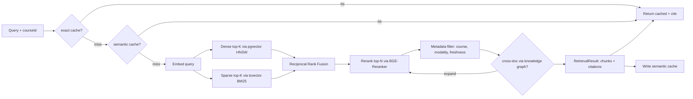

# Deliverable 6 — RAG Architecture

**Status:** Draft v0.1
**Owner:** AI Platform
**Last updated:** 2026-05-21
**Implements:** [`prompt.md`](../../prompt.md) §6
**Source of truth:** [`apps/ai-worker/src/rag`](../../apps/ai-worker/src/rag) · [`packages/rag-core`](../../packages/rag-core)

---

## (a) Design rationale

RAG is the substrate that turns a pile of uploaded course material into a tutor that doesn't lie. Every other AI feature in StudyForge — quiz generation, flashcards, roadmap, diagrams — is a downstream consumer of one retrieval policy. We collapse that into a single library so optimisation (caching, reranking thresholds, fusion weights) compounds across the whole platform.

Five constraints drive the design:

1. **Citations are mandatory output.** Every retrieval result carries `(doc_id, version_id, page|slide|cell, char_start, char_end, score)` — the exact same shape as the `Citation` Pydantic model from §5. The retrieval layer is the source of citation metadata; the response layer enforces presence; without metadata, refusal.
2. **Hybrid retrieval is not optional.** Dense alone misses exact-string lookups (codes, formulas, named entities). Sparse alone misses paraphrase. We always run both, fuse with Reciprocal Rank Fusion, and rerank the fused top-N. The default open-model stack — BGE-M3 dense + Postgres BM25-style `tsvector` sparse + BGE-Reranker — is free at inference time, which is what makes the platform-cost target achievable.
3. **Per-modality chunking is structural, not statistical.** Slides chunk per slide. Notebook cells chunk per cell. Code chunks per AST function/class via tree-sitter. Text chunks by heading boundary first, then sentence-window with overlap. Token-count chunking is the fallback inside a chosen structural unit, never the only signal. The reason: a 500-token chunk that crosses a slide boundary becomes uncitable — you can't say "page 12 + page 13 simultaneously" in a useful citation.
4. **Caching is layered, not optional.** Prompt cache (provider-native), semantic cache (GPTCache + BGE-M3), exact-match cache (Redis), course-shared artifact cache (content-hash). Hit-rate targets are §13 acceptance criteria, but they're enforced here. The retriever exposes a single `retrieve(query, course_id, k)` API; the cache layers sit in front of it transparently.
5. **Eval-as-CI.** Every prompt and every retrieval policy change ships with a golden-set delta. The Ragas thresholds (faithfulness ≥ 0.85, context precision ≥ 0.80, context recall ≥ 0.75) are CI gates, not aspirations. A PR that doesn't run the harness on a touched component fails.

The Phase 0 implementation in this commit:

- Defines Pydantic contracts for chunks, candidates, retrieval requests, results.
- Implements **deterministic Reciprocal Rank Fusion** with a pluggable `k` constant.
- Implements a **structural text chunker** (heading-aware, sentence-window, overlap-tuned) and the **modality dispatcher** that picks chunkers per block type.
- Implements the **Retriever orchestrator** with pluggable `Embedder`, `SparseRetriever`, `DenseRetriever`, `Reranker`, `Cache` interfaces.
- Ships stubs for the model-backed components (`BgeM3Embedder`, `BgeReranker`) so the orchestrator round-trips end-to-end without GPU. The real implementations land in Phase 1.
- Adds pytest cases for RRF determinism, chunker boundary preservation, and citation pass-through.

---

## (b) Architecture artifacts

### Pipeline



### Chunking strategy (per modality)

| Modality | Unit | Overlap | Notes |
|---|---|---|---|
| `text` | Heading section → sentence window (≤ 512 tokens, hard cap 768) | 96 tokens between sibling chunks within a section; 0 across heading boundaries | Heading boundaries always preserved; chunk metadata carries the resolved heading path (`h1 > h2 > h3`). |
| `slide` | One chunk per slide | None | Speaker notes attached as a child block (`meta.speaker_notes`); titles weighted in sparse index. |
| `notebook_cell` | One chunk per cell | None | Outputs are siblings, not concatenated; code-cell outputs that exceed 4 KB are truncated with a `meta.truncated=true` marker. |
| `code` | Tree-sitter AST nodes at function / class / module granularity | 0 (AST overlap is meaningless) | Module-level imports duplicated into each function chunk's `meta.imports` for retrieval recall. |
| `table` | One chunk per table | None | Markdown serialisation for sparse index; raw rows in `meta.rows`. |
| `formula` | One chunk per displayed equation | None | LaTeX + sympy-rendered ASCII + plain-language description (generated by Semantic Analyzer §5). All three are stored on `content`, separated by newlines. |
| `image_ocr` | Whole image | None | Tesseract / PaddleOCR transcript becomes the `content`; confidence < 0.6 chunks are marked `meta.low_confidence=true` and de-weighted in retrieval. |

The dispatcher in `apps/ai-worker/src/rag/chunker.py` selects the strategy from `block.modality`. New strategies plug in via the `ChunkStrategy` protocol.

### Index topology

**Dense.** BGE-M3 1024-dim embeddings stored in `Chunk.embedding` (Postgres `pgvector`), HNSW indexed (`m=16, ef_construction=64`, `vector_cosine_ops`). Per-tenant isolation via the RLS policy on the `Chunk` join through `Document → Tenant`.

**Sparse.** `Chunk.tsv` (`tsvector`) populated by the `chunk_tsv_refresh` trigger from Deliverable 3; weighted `setweight(text, 'A') || setweight(modality, 'B')`. Queries run as standard `tsv @@ phraseto_tsquery('english', :q)` with `ts_rank_cd` ordering.

**Trigram fallback.** `Chunk.content` has a GIN `gin_trgm_ops` index for partial-word lookups when both dense and sparse miss. Used by `Search` (Deliverable 4), not by the tutor path.

### Reciprocal Rank Fusion

For result set `R` with retrievers `r ∈ {dense, sparse}`:

```
RRF_score(c) = Σ_r 1 / (k + rank_r(c))
```

Default `k = 60` (industry standard). Fusion is rank-only — scores are intentionally discarded because dense cosine and sparse BM25 are on incomparable scales. The fused list is the input to reranking; reranker scores survive into `score` on the citation.

### Reranking

Default: **BGE-Reranker (open, self-hosted)**. Inputs: `(query, chunk_content)`; output: a single score in `[0, 1]`. The top-N (default 20 → reranked → top-5) from fusion is reranked. The reranker is feature-flagged to allow A/B against Cohere Rerank 3 for paid tenants.

### Retrieval API

```python
@dataclass
class RetrievalRequest:
    tenant_id: str
    course_id: str | None
    query: str
    k: int = 5                  # final returned chunks
    fusion_k: int = 60
    candidates_per_retriever: int = 20
    metadata_filter: MetadataFilter | None = None

class Retriever:
    async def retrieve(self, req: RetrievalRequest) -> RetrievalResult: ...
```

`RetrievalResult` carries `chunks: list[RetrievedChunk]` (same shape as the Tutor agent's input), plus retrieval-time telemetry (`dense_latency_ms`, `sparse_latency_ms`, `rerank_latency_ms`, `cache_hit`).

### Caching layers

| Layer | Implementation | TTL | Key |
|---|---|---|---|
| Provider prompt cache | Anthropic / Gemini / OpenAI native | 5 min (extended 1 h) | Provider-managed |
| Semantic cache | GPTCache + BGE-M3 + Redis | 1 h default, configurable | `(tenant_id, course_id, query_embedding)` with similarity ≥ 0.92 |
| Exact-match cache | Redis | 24 h | `sha256(tenant_id || course_id || query_normalized)` |
| Course-shared artifact cache | Postgres `SharedArtifact` | until source change | `contentSha256` of the canonical document set |

Cache invalidation: every `DocumentVersion` write enqueues a `cache.purge` job carrying `(course_id, doc_id, version_id)`. The job removes affected semantic-cache rows and bumps a per-course generation counter that gates exact-match cache hits.

### Cross-document linking via the knowledge graph

When the top-K from reranking is "thin" (≤ 2 chunks above the support threshold), the retriever expands the candidate set by traversing one hop in the `Concept` graph: pull concepts associated with the surviving chunks, fetch chunks tagged to neighboring concepts, re-rerank. This is feature-flagged (`rag.kg-expand`) because it costs an extra reranker call.

### Citation enforcement (cross-reference)

The retriever produces `RetrievedChunk` objects with full citation metadata; the response layer (Tutor agent et al.) attaches them to claims and refuses on absence. See §5 for the response-layer detail.

### Eval framework (`packages/eval-harness`)

Golden sets live as JSONL files at `packages/eval-harness/golden/<prompt_or_rag_id>/<version>/cases.jsonl`. Each case:

```json
{
  "course_fixture": "ml-intro-2024",
  "query": "What is the role of the learning rate in gradient descent?",
  "expected_chunks": ["chunk_id_a", "chunk_id_b"],
  "must_not_contain": ["overfitting"]
}
```

CI runs Ragas on every PR that touches:

- `packages/llm-router/src/prompts/**`
- `apps/ai-worker/src/agents/**`
- `apps/ai-worker/src/rag/**`

| Metric | Threshold | Behaviour on fail |
|---|---|---|
| Ragas faithfulness | ≥ 0.85 | Block merge |
| Ragas context precision | ≥ 0.80 | Block merge |
| Ragas context recall | ≥ 0.75 | Block merge |
| Ragas answer relevancy | ≥ 0.85 | Block merge |
| Quiz rationale-consistency (custom) | ≥ 0.95 | Block merge |

Each metric is computed on the touched component's golden set. A new prompt without a golden set is rejected at PR-creation time by a required-status check.

### Telemetry

Every retrieval emits one OTel span (`rag.retrieve`) carrying:

```json
{
  "tenant_id": "…",
  "course_id": "…",
  "query_token_count": 12,
  "dense_candidates": 20,
  "sparse_candidates": 20,
  "fused_candidates": 32,
  "reranked_returned": 5,
  "semantic_cache_hit": false,
  "exact_cache_hit": false,
  "kg_expanded": false,
  "dense_latency_ms": 18,
  "sparse_latency_ms": 9,
  "rerank_latency_ms": 47,
  "total_latency_ms": 81
}
```

These rows feed the RAG quality dashboard (Grafana) and the Ragas trend over time.

---

## (c) Trade-offs explicitly rejected

| Rejected | Reason |
|---|---|
| **Token-count chunking only** | Cuts mid-slide, mid-cell, mid-function. Wrecks citations and reranker quality. Structural-first is mandatory; token cap is a fallback inside structural units. |
| **Score-weighted fusion (`α·dense + β·sparse`)** | Dense and sparse scores are on different scales; weights need re-tuning per corpus. RRF is rank-only and parameter-free in practice (just `k`). |
| **One vector store per modality** | Operational overhead and prevents cross-modality reranking. Single `pgvector` table with a `modality` column wins. |
| **Embedding chunks at retrieval time** | Defeats the cost target and the latency budget. All chunks are embedded at ingest; retrieval embeds the query only. |
| **Cohere Rerank 3 as the default** | Paid per-call, defeats the free-tier-first principle. BGE-Reranker is the default; Cohere is a configurable upgrade for paid tenants only. |
| **Pinecone as the dev default** | Cost during local dev and increased CI complexity. Postgres `pgvector` covers dev → small prod; Pinecone is an opt-in adapter that swaps `DenseRetriever` only. |
| **Letting tutor / quiz generators do retrieval themselves** | Each agent reimplements caching, fusion, and citation building badly. The retriever is a single library; agents consume it. |
| **Cross-document expansion always on** | Doubles reranker latency on simple queries. Flag-gated, triggers only when reranked top-K is thin. |
| **Storing raw provider rerank scores in the response** | Reranker scores are model-private and don't survive reranker swaps. Citations carry the reranker score under `score`, the contract is "higher is more supportive within this run." |
| **Manual prompt + retrieval tuning** | Ragas-as-CI is the only signal that compounds over time. We don't ship retrieval changes by feel. |
| **One semantic cache TTL for all use cases** | Tutor needs short TTL (course material changes); roadmap needs long TTL (student model changes are the invalidator, not the source). TTLs are per-cache-key with sensible defaults. |
| **LlamaIndex / LangChain as the retrieval runtime** | We use them for parsing helpers (PDF, notebook) but not as the retrieval orchestrator. Both make hybrid retrieval indirect and lock us into specific defaults. The custom orchestrator is ~400 lines. |

---

## Next deliverables

- [Deliverable 7 — Knowledge Graph](./07-knowledge-graph.md) — concept extraction + the cross-doc expansion this RAG layer relies on.
- [Deliverable 13 — Cost & Access](./13-cost-and-access.md) — semantic + shared cache hit-rate targets and how they sum to the free-tier MAU cost.
