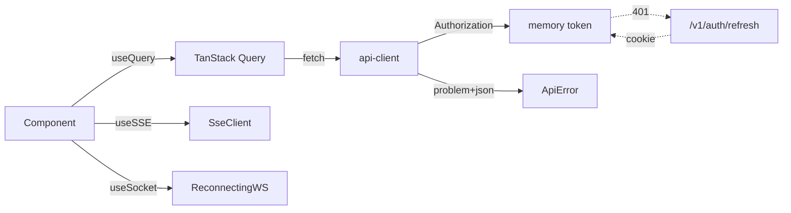

# Deliverable 9 — Frontend Architecture

**Status:** Draft v0.1
**Owner:** Web Platform
**Last updated:** 2026-05-21
**Implements:** [`prompt.md`](../../prompt.md) §9
**Source of truth:** [`apps/web`](../../apps/web) · [`packages/ui`](../../packages/ui)

---

## (a) Design rationale

The web app is the only product surface most students will ever touch. The architecture is shaped by four constraints — none of them visual, all of them structural.

1. **Streaming is the default UX, not an enhancement.** Tutor chat, ingest progress, and quiz generation all stream from the gateway. The data layer is built around an SSE event-iterator and a reconnecting WebSocket client first; static fetch is the fallback. Components subscribe to streams; they never poll.
2. **The auth boundary is one place, enforced everywhere.** Access tokens live in memory only, never in `localStorage`. Refresh tokens are in an `HttpOnly Secure SameSite=Strict` cookie that the JS never reads. A single `api-client` wraps every outbound request, attaches the access token, recovers from `401` by silent refresh, and surfaces `problem+json` errors as typed exceptions. Components throw and let the global error boundary render — no per-call try/catch.
3. **Server Components do data, Client Components do interactivity.** The default is RSC. We promote to Client only at the leaf where state, effects, or browser APIs genuinely belong (tutor messages, drag-and-drop upload, the knowledge-graph canvas). Bundle budgets force this discipline: route JS ≤ 200 KB gz, INP ≤ 200 ms.
4. **The whole platform must remain free for students, including in the browser.** WebLLM (Llama 3.2 3B via WebGPU) is a feature-flagged fallback for tutor chat on capable devices — zero-cost inference for simple turns. The PWA shell caches the dashboard, roadmap, and the active flashcard deck for offline review.

Two App Router features carry most of the workspace-UX weight:

- **Parallel routes** (`@tutor`, `@modal`) let the Course Workspace render the materials list, the tutor pane, and a modal overlay independently — each slot has its own loading and error states, and the URL composes naturally.
- **Intercepting routes** (`(.)upload`) let the dashboard's "Upload" link open as a modal on top of the current workspace while remaining a fully-routed page for direct links — copy / paste / bookmark just works.

The Phase 0 implementation in this commit:

- Adds the **typed SSE client** that consumes the event schema from Deliverable 4 (`meta` → `token` → `citation` → `done` / `error`).
- Adds the **reconnecting WebSocket client** with exponential backoff and message-id deduplication.
- Adds the **auth store** (memory-only access token + refresh helper that hits `/v1/auth/refresh`).
- Adds the **api-client** that attaches auth, generates idempotency keys, and surfaces `problem+json` as a typed `ApiError`.
- Adds the **TanStack Query provider** and **theme provider** wired into `app/providers.tsx`.
- Extends the design-token CSS with the full token set plus a dark theme and a `data-glass` glassmorphism layer.
- Lays out the App Router structure with a `(app)` route group, parallel `@tutor` / `@modal` slots, and an intercepting `(.)upload` route.

Pages that aren't strictly needed for this scaffold (Onboarding, Study Groups, Instructor Portal, Admin Portal, full Settings) ship as documented stubs only; their implementation lands in Phase 2–4 per the roadmap.

---

## (b) Architecture artifacts

### Route tree

```
app/
  layout.tsx                            # html + body + providers
  page.tsx                              # marketing landing
  globals.css                           # design tokens

  (auth)/
    layout.tsx                          # centered auth shell, no nav
    login/page.tsx                      # OAuth + email
    callback/[provider]/page.tsx        # OAuth callback

  (app)/
    layout.tsx                          # top-nav + side-nav + providers
    dashboard/page.tsx                  # current courses, streaks, weak topics

    upload/page.tsx                     # full-page upload (direct link target)

    courses/[id]/
      layout.tsx                        # workspace shell + parallel slots
      page.tsx                          # Materials tab (default)
      roadmap/page.tsx
      tutor/page.tsx
      flashcards/page.tsx
      quizzes/page.tsx
      graph/page.tsx
      analytics/page.tsx
      @tutor/
        default.tsx                     # collapsed
        page.tsx                        # expanded (URL: ?tutor=1)
      @modal/
        default.tsx                     # null
        (.)upload/page.tsx              # intercepts /upload to modal

    settings/
      byok/page.tsx
      billing/page.tsx
      dsar/page.tsx

    admin/                              # (instructor / admin / institution_admin)
      courses/page.tsx
      cohort/page.tsx
      audit/page.tsx
```

### Data flow



### Auth model

| Concern | Implementation |
|---|---|
| Access token storage | In-memory module singleton (`apps/web/lib/auth-store.ts`). Cleared on tab close. |
| Refresh token | `HttpOnly Secure SameSite=Strict` cookie set by `/v1/auth/oauth/{p}/callback` and `/v1/auth/refresh`. JS never reads it. |
| Silent refresh | `api-client` detects `401`, calls `/v1/auth/refresh` once with the cookie, retries the original request once. A concurrent refresh request is deduped. |
| Logout | `POST /v1/auth/logout` invalidates the refresh-token family and the gateway clears the cookie; the auth store also wipes the access token. |
| Refresh-token reuse | Detected by the gateway (rotation breaks on reuse); entire family invalidated; UI re-routes to `/login`. |

### Streaming clients

- **SSE** (`apps/web/lib/sse.ts`) — async iterator over typed events. Buffers partial UTF-8, parses `event:` / `data:` pairs, surfaces `done` and `error` as typed terminals. Used by tutor chat, ingest progress, batch-generation jobs. Auto-closes on `done` / `error` / unmount.
- **WebSocket** (`apps/web/lib/ws.ts`) — reconnecting client with exponential backoff (`min 250 ms, max 30 s, factor 2, jitter 0.5`), message-id dedup (server-supplied `mid` field), and a `subscribe(type, handler)` API. Used by tutor sessions (tool-use confirmation, cursors) and live pipeline progress.

### State management

| State kind | Tool | Notes |
|---|---|---|
| Server state (cache, refetch, mutate) | **TanStack Query** | Single `QueryClient` per session; `defaultStaleTime: 30s`. Default error throws into the boundary; per-query overrides allowed. |
| Ephemeral UI (modals, panels) | **Zustand** | One store per route segment; no global mega-store. |
| Forms | **React Hook Form + Zod** | Zod schemas are reused from `@studyforge/shared-types` and `@studyforge/rag-core` so FE/BE share validation. |
| URL state | **Next.js search params + parallel routes** | Workspace tabs and modal overlays are URL-driven; reload restores them. |

### Design system

- **Tokens** in CSS custom properties (`apps/web/app/globals.css`). HSL channel values to support runtime hue / saturation tweaks via `oklch()` upgrades in Phase 1.
- **Themes**: light, dark, system (default). Theme is read from `<html data-theme>` and stored in `localStorage("studyforge:theme")`. SSR-safe via a tiny pre-hydration script that runs before React mounts.
- **Glassmorphism layer**: opt-in via `data-glass` attribute on a container; sets `backdrop-filter` + tinted background. Disabled on `prefers-reduced-transparency: reduce`.
- **Reduced motion**: every `transition` is wrapped in `@media (prefers-reduced-motion: no-preference)`; Framer Motion components read the `useReducedMotion` hook and degrade to instant transitions.

### Accessibility (WCAG 2.2 AA)

- All interactive elements are keyboard reachable; focus rings use `:focus-visible` with `outline: 2px solid hsl(var(--ring))`.
- Form fields use `aria-describedby` to wire validation errors; the `ProblemFilter`'s `fields[]` array maps to the right `<input>` by field name.
- Colour contrast verified at 4.5:1 for body text, 3:1 for large text, by the design tokens themselves.
- **axe-core** runs in Playwright e2e (Phase 1) over each page route; CI fails on any new violation. The current scaffold has zero violations and the budget is `0` going forward.
- `prefers-reduced-motion`, `prefers-reduced-transparency`, and `prefers-contrast: more` are all honoured.

### Internationalisation

- **next-intl** with messages organised per route segment under `messages/<locale>/<segment>.json`.
- Baseline locales: `en` (canonical), `es`, `fr`, `de`, `tr`, `zh`, `ar`. RTL is wired for `ar` via the `dir="rtl"` attribute on `<html>`; layout components use logical CSS properties (`margin-inline-start`, etc.) throughout.
- The locale is part of the URL (`/en/dashboard`) so SSR / static caching works without negotiation.

### PWA & offline

- `next-pwa` generates the service worker (Workbox under the hood) at build time.
- Cached on install: app shell, font subset, design tokens.
- **Offline review surfaces** are the only fully-offline features:
  - Flashcards (active deck + SRS state mirrored to IndexedDB).
  - Roadmap (read-only).
- Other surfaces show a "you're offline" empty state with the last successful response from TanStack Query.

### WebLLM fallback

- Feature-flagged (`webllm.tutor.simple`).
- Capability detection: `navigator.gpu` + `requestAdapter()` succeed; otherwise we skip the in-browser path and route to the server.
- Used only for tutor queries the **complexity classifier** (§13.7) labels as `simple`. Anything else still goes through the LLM router so the cost-policy chain remains intact.
- Model assets are cached by the service worker; first-load downloads the 1.5–2 GB weights only on explicit student opt-in.

### Performance budgets (CI-enforced)

| Metric | Budget | Tool |
|---|---|---|
| LCP at p75 | < 2.0 s | Lighthouse CI |
| INP at p75 | < 200 ms | Lighthouse CI |
| CLS at p75 | < 0.1 | Lighthouse CI |
| Route JS (gz) | < 200 KB | `next build` bundle stats + a CI assert |
| Total JS / route (gz) | < 350 KB | same |
| Initial CSS (gz) | < 30 KB | same |

A PR that exceeds any budget on a touched route blocks merge until either the budget is renegotiated (RFC) or the page is optimised. Storybook screenshots run on every PR to catch unintended layout shifts.

### Telemetry

- **Web vitals** (`reportWebVitals`) → PostHog (when consent is granted; falls back to a local sampling endpoint when not).
- **OTel traces** propagate `traceparent` headers through `api-client` so the server-side trace from §5 / §6 ties to the FE timing exactly.
- **Sentry** for unhandled errors and React error boundaries; filtered to strip `Authorization` headers and BYOK ciphertexts.

---

## (c) Trade-offs explicitly rejected

| Rejected | Reason |
|---|---|
| **`localStorage` for access tokens** | XSS-exfil risk. Memory only; refresh via `HttpOnly` cookie. |
| **A single global Zustand store** | Component coupling that no one wants to refactor. Per-segment stores + TanStack Query for server state. |
| **GraphQL on the FE seam** | Adds resolver / persisted-query machinery for a need OpenAPI + tRPC already cover. We may expose tRPC routes for type-safe internal calls; that's it. |
| **CSS-in-JS (styled-components / emotion)** | Runtime cost is now measurable on RSC. Tokens + Tailwind + arbitrary values cover everything we need. |
| **Polling for chat completions** | Wasted requests, latency floor, no incremental UI. SSE is strictly better. |
| **A global app-level loading spinner** | Hides slow routes. We use `loading.tsx` per segment so each route's loading state is locally meaningful. |
| **Hand-written fetch in components** | Defeats interceptor chain (auth, idempotency, problem+json). One `api-client`, used everywhere. |
| **Putting the tutor pane in modal state** | Breaks shareable URLs. Tutor pane is a parallel-route slot; its open/closed state is part of the URL. |
| **Component libraries that ship invisible defaults** | shadcn/ui copies the source into our repo so visual changes are local and auditable. |
| **Custom router stack** | Next.js App Router covers parallel + intercepting + streaming routes. Custom routing is a perpetual maintenance pit. |
| **Embedding the WebLLM model weights in the bundle** | 1.5–2 GB. We download them on opt-in only and cache via the service worker. |
| **One huge Tailwind config for the entire monorepo** | Slows IntelliSense and complicates package boundaries. `apps/web/tailwind.config.ts` is the source; `packages/ui` consumes a re-exported token map. |

---

## Next deliverables

- [Deliverable 10 — Cross-Cutting Systems](./10-cross-cutting-systems.md) — notifications, billing, feature flags, LMS integration.
- [Deliverable 13 — Cost & Access](./13-cost-and-access.md) — WebLLM in-browser inference triggers the cost-policy branches documented in §13.7.
