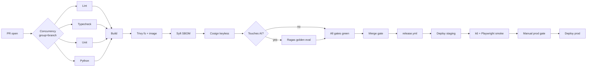

# Deliverable 11 — DevOps & Delivery

**Status:** Draft v0.1
**Owner:** Platform
**Last updated:** 2026-05-21
**Implements:** [`prompt.md`](../../prompt.md) §11
**Source of truth:** [`.github/workflows`](../../.github/workflows) · [`infra/helm`](../../infra/helm) · [`infra/grafana`](../../infra/grafana) · [`.devcontainer`](../../.devcontainer)

---

## (a) Design rationale

Every other deliverable is shaped by the rule that **a PR cannot reach production unless every gate has run and passed on the changeset that ships**. We design the pipeline as a single, linear sequence of gates — each one fast enough to fail in seconds, scoped so a regression in one cluster (e.g. RAG quality) blocks only the affected services. Two-track CI (one slow, one fast) is rejected as a false economy: it produces "slow main" rot.

Three principles drive every decision:

1. **Build once, sign once, deploy many.** A single image per service is produced per commit. Staging and production deploy that exact byte-identical image, identified by digest. Cosign signs the digest; admission controllers refuse unsigned images in production.
2. **Configuration is data, not code.** Helm values per environment (dev / staging / prod) carry the deltas — replica counts, resource limits, feature-flag defaults. Templates have no environment branches; that lives only in values. Helm-rendered manifests are committed for audit (`infra/helm/rendered/`) and diffed in PRs.
3. **Observability is wired before the feature ships.** Every service emits OTel traces, the metrics-without-which the SLO is undefined, and at least one structured log line per request. Dashboards for the four hot metrics (queue depth, token spend per tenant, provider quota burn, cache hit rate) ship with the chart, not after.

The Phase 0 implementation in this commit:

- Extends `.github/workflows/ci.yml` into the full **lint → typecheck → unit → build → scan → sign** pipeline with explicit caching, concurrency control, and a dedicated AI-eval job that runs when the affected paths change.
- Adds `.github/workflows/release.yml` carrying the **build → SBOM → sign → publish** flow that produces signed digests staging + prod read from.
- Adds the **Helm chart skeleton** under `infra/helm/studyforge/` with the Chart.yaml, base values, environment overlays, and the representative `web` / `api` / `ai-worker` templates.
- Adds the **devcontainer / Codespaces config** so a fresh clone is one click away from `make dev`.
- Adds **Prometheus alert rules** for token-spend burst, RAG-quality drop, queue-depth backlog, and Core Web Vitals regression.
- Adds **Lighthouse CI config** that enforces the §9 performance budgets.

The remaining systems — Velero K8s backup, full Grafana dashboards, Storybook + Docusaurus — are documented here and ship in Phase 4.

---

## (b) Architecture artifacts

### CI pipeline shape



| Gate | Purpose | Avg duration | Fails on |
|---|---|---|---|
| Lint | ESLint + Ruff | 30 s | warnings (configured as errors) |
| Typecheck | `pnpm typecheck` + `mypy --strict` | 60 s | any error |
| Unit | `pytest` + Vitest | 90 s | any failure |
| Build | `next build`, `nest build`, Docker image | 4 min | non-zero exit |
| Scan | Trivy `fs` + image scan | 30 s | HIGH / CRITICAL CVE |
| SBOM | Syft → SPDX JSON | 10 s | empty SBOM |
| Sign | Cosign keyless (OIDC) | 5 s | signing failure |
| Eval | Ragas + Promptfoo golden eval | 2 min | thresholds from §6 |
| Smoke | k6 + Playwright on staging | 3 min | timeouts, broken auth |

Concurrency is grouped by `${{ github.workflow }}-${{ github.ref }}` so consecutive pushes to the same PR cancel in-flight runs.

### Image build invariants

Every service Dockerfile:

- Uses a multi-stage build (`deps → build → runtime`).
- Runtime stage is `gcr.io/distroless/nodejs20-debian12` (Node) or `python:3.11-slim` reduced via a distroless step (Python — TODO Phase 1).
- Runs as `nonroot` (UID 65532).
- Carries an `EXPOSE` matching the readiness probe.
- Is published as `ghcr.io/studyforge/<service>@sha256:…` — never by tag in production manifests.

### Helm layout

```
infra/helm/studyforge/
  Chart.yaml
  values.yaml                    # base defaults
  values-dev.yaml                # overrides for kind/k3d
  values-staging.yaml
  values-prod.yaml
  templates/
    _helpers.tpl
    web-deployment.yaml
    web-service.yaml
    web-ingress.yaml
    api-deployment.yaml
    api-service.yaml
    api-hpa.yaml
    ai-worker-deployment.yaml
    ai-worker-service.yaml
    secret.yaml
    NOTES.txt
```

Templates have no environment branches. Overrides live exclusively in `values-*.yaml`. The chart deploys side-by-side with cluster infra (Postgres, Redis, MinIO, Meili) which is its own Helm release (`infra/helm/studyforge-infra/`, scaffolded in Phase 4).

### Image promotion path

| Source | Action | Image |
|---|---|---|
| PR push | Build + scan + sign on a throwaway tag | `ghcr.io/studyforge/web:pr-<sha>` |
| `main` merge | Same image promoted | `ghcr.io/studyforge/web:main-<sha>` |
| Release tag `v*` | Promoted, retagged | `ghcr.io/studyforge/web:v0.X.Y` |
| Production | Pulled by digest (never tag) | `ghcr.io/studyforge/web@sha256:…` |

The digest used in production is captured in `infra/helm/rendered/prod-<release>.yaml` and committed — making "what's running in prod right now?" a `git blame` question, not a `kubectl` question.

### Observability

- **Traces**: OTel SDKs in NestJS, FastAPI, Next.js (server functions). One trace per request from edge to provider.
- **Metrics**: Prometheus scrape of every service's `/metrics`. Service-specific RED metrics + four platform-wide hot signals (queue depth, token spend per tenant, provider quota burn, cache hit rate).
- **Logs**: structured (Pino / structlog), shipped to Loki. Sensitive fields stripped at the formatter layer (see §8).
- **Alerts** — in this commit (`infra/grafana/alerts.yaml`):
  - `TokenSpendBurst` — daily spend rate > 3× 7-day median, page on call.
  - `RagFaithfulnessDrop` — Ragas faithfulness 7-day rolling avg < 0.85, ticket the AI team.
  - `QueueBacklog` — ingest queue depth > 5 000 for 10 min, page.
  - `CoreWebVitalsLcp` — LCP p75 > 2.5 s for 30 min, ticket the web team.
  - `SandboxFailRate` — sandbox failures > 5% over 1 h, page (likely escape attempt or supply-chain issue).

### Performance gates (FE)

`apps/web/lighthouserc.json` runs Lighthouse on every PR that touches `apps/web/**`. The budgets from §9 are the gate:

| Assertion | Budget |
|---|---|
| LCP | < 2.0 s |
| INP | < 200 ms |
| CLS | < 0.1 |
| Total transfer (route) | < 350 KB gz |
| JS transfer (route) | < 200 KB gz |
| Accessibility score | ≥ 95 |

### DR + backups

| Asset | Backup | RPO | RTO |
|---|---|---|---|
| Postgres primary | Continuous WAL ship + nightly snapshot | 15 min | 60 min |
| Object storage | Versioned bucket + cross-region replication | 0 (continuous) | 30 min |
| K8s cluster state | Velero nightly to S3 | 24 h | 60 min |
| Helm-rendered manifests | Committed to repo | 0 | instant |
| Secrets | KMS-replicated cross-region | 0 | instant |

Quarterly drill: restore Postgres + Velero into a fresh cluster, smoke test, decommission. The drill is itself a CI workflow (`.github/workflows/dr-drill.yml`, scaffolded in Phase 4).

### Devcontainer / Codespaces

`.devcontainer/devcontainer.json` declares Node 20, Python 3.11, uv, pnpm, Docker-in-Docker, and the postCreateCommand `make bootstrap`. A fresh Codespace runs `make up && make dev` in ≤ 90 s. The same definition is what local devs get via VS Code "Reopen in container."

### Storybook + Docusaurus

- Storybook in `packages/ui` (Phase 4) — every component documented, axe-core add-on enforces the WCAG budget per story.
- Docusaurus in `docs/site` (Phase 4) — auto-generated API reference from the OpenAPI spec; ADR index; the architecture documents in this directory mirrored to a public site for institutional buyers.

---

## (c) Trade-offs explicitly rejected

| Rejected | Reason |
|---|---|
| **Two-track CI (fast + slow)** | Becomes "slow main never green." One linear pipeline that's fast enough to fail in seconds wins. |
| **Tag-based production deploys** | Mutable. Production pulls by digest only; tags exist for human convenience. |
| **Per-service Helm chart** | Drift between services. One chart with per-deployment templates; per-service teams own their template. |
| **Argo CD pull-based deploys** | Excellent tool but adds an operational store we don't need until we have > 5 services. Push from CI is sufficient through Phase 4. |
| **Storing Helm-rendered manifests in S3** | Loses the `git blame` answer. We commit them. |
| **Velero as a complete DR strategy** | Velero handles K8s state; databases need their own backup story. We treat the two as orthogonal. |
| **Building images on every developer machine** | Slow + non-reproducible. CI builds; developers run `docker pull` if they need the production image locally. |
| **A separate "release" PR** | Bureaucratic noise. Merging to `main` triggers release.yml; tagging a release is a manual step on the resulting image. |
| **Disabling Trivy scans for "false positives"** | Suppression by CVE id with a 90-day re-review is the only allowed escape hatch. CVE-blanket-disables are forbidden. |
| **Letting CI write to GHCR with a long-lived PAT** | `GITHUB_TOKEN` scoped to the repo + ephemeral OIDC for Cosign. No secrets stored in CI variables for image push. |
| **A custom dashboard JSON per service** | Five services → five places to update when adding a metric. We use templated panels with a `service` variable. |

---

## Next deliverables

- [Deliverable 12 — Implementation Roadmap](./12-implementation-roadmap.md) — what ships in which phase, mapped to these gates.
- [Deliverable 13 — Cost & Access Architecture](./13-cost-and-access.md) — observability for cost lives here.
