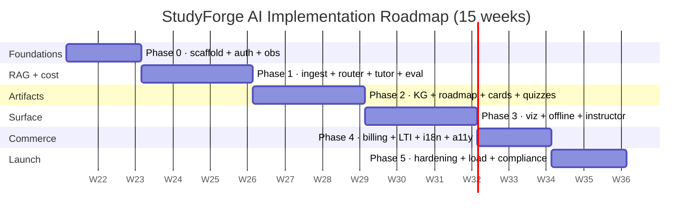

# Deliverable 12 — Implementation Roadmap

**Status:** Draft v0.1
**Owner:** Platform
**Last updated:** 2026-05-21
**Implements:** [`prompt.md`](../../prompt.md) §12

---

## (a) Design rationale

The roadmap sequences six phases of work over ~15 weeks. The sequence is not arbitrary — three constraints lock it in:

1. **Free-tier-first must land in Phase 1.** Every later feature consumes the LLM router. If we ship Phase 2's quiz generator before the router exists, we either (a) bind quiz generation to a single provider and burn money, or (b) refactor every agent later. Phase 1's router + BYOK + prompt caching is the load-bearing foundation; Phase 2 is multiplicative on top of it.
2. **Citations must be wired before generation.** RAG retrieval + citation enforcement land before quizzes and flashcards. Otherwise we ship generators that produce uncited content, then "add citations later" — which is how products end up with confident, wrong, beautiful answers. Phase 1's tutor + Phase 1's retriever come first; Phase 2 builds on the citation contract.
3. **Compliance + load testing come last, deliberately.** FERPA / GDPR / WCAG reviews require the actual feature surface to exist. We run them in Phase 5 against the launchable product, not against a roadmap diagram.

Two other ordering decisions matter:

- **Observability skeleton ships in Phase 0**, not Phase 4. Without OTel traces and the cost ledger live from day one, we cannot tell which Phase-2 features are blowing the cost budget. The dashboards are empty for a while; that's fine.
- **WebLLM and offline PWA land in Phase 3**, not Phase 4 with billing. They unlock the "$0 platform cost" branches the §13 cost story depends on. We need them in the product before paid Pro launches in Phase 4 so the free tier remains demonstrably viable.

The roadmap is presented as **phase → deliverables → exit criteria → dependencies → risk register**. Every exit criterion is a CI gate, an integration test, or a metric threshold — nothing subjective.

---

## (b) Phased plan

### Snapshot of the current commit

This commit closes architecture Deliverables 1–11 + 13 and ships the scaffold + load-bearing primitives for Phase 0 and parts of Phase 1. Specifically:

| Already shipped (scaffold + load-bearing primitives) | Phase |
|---|---|
| Turborepo + Docker Compose + CI + Helm chart + devcontainer | 0 |
| Postgres + pgvector schema + RLS + hash-chained audit | 0 |
| API gateway (NestJS) with problem+json, idempotency, cursor pagination | 0 |
| Web app shell (Next.js 15, parallel + intercepting routes, design tokens) | 0 |
| AI worker (FastAPI) with health endpoints + agent contracts for all 12 agents | 0–1 |
| Orchestrator state machine + Tutor agent refusal path (verified via pytest + curl) | 1 |
| RAG core (RRF fusion, chunker dispatcher, retriever orchestrator with Protocols) | 1 |
| Knowledge-graph algorithms (cycle detection, topo sort, expander, Cytoscape spec) | 2 |
| Safety modules (injection scoring, PII redaction, channel-separated prompt builder) | 1 |
| BYOK envelope encryption (AES-256-GCM + KEK-wrapped DEK, live-tested) | 1 |
| Tier policy + budget evaluator (downshift / rate-limit / block); production refuses `block` on `free` | 1 |
| Quiet-hours scheduler + artifact diff helper | 2 |
| LTI 1.3 launch validator with RS256 signature verification (live-tested) | 4 |
| Observability skeleton: Prometheus alerts + Grafana cost dashboard + Lighthouse CI | 0–4 |

Everything else is gated to its phase below.

### Phase 0 — Foundations (Wk 1–2)

**Goal:** A new engineer clones the repo, runs `make bootstrap && make up && make dev`, and has every service responding within 5 minutes.

**Deliverables remaining:**

- OAuth (Google, Microsoft EDU, GitHub) end to end through the gateway, refresh-cookie rotation, CASL guards on every controller.
- SSO scaffolding (SAML metadata loader, JWKS cache) ready for the LTI launch wiring in Phase 4.
- Resumable upload flow against MinIO with the validation rules from `UploadInitDto`.
- Baseline dashboard route fetching real Prisma rows (Course / Enrollment / Document).
- OTel collector + Prometheus + Grafana stack running via `make up-observability` (a new profile).
- Sentry wired into web + api + ai-worker with sensitive-field stripping.

**Exit criteria:**

- A new engineer's first PR includes a passing unit test, a Storybook entry (if it touches `packages/ui`), and a green Lighthouse CI run.
- `make up && make dev` succeeds on a fresh clone in ≤ 90 s on reference hardware.
- A signed-in user can hit `/v1/me`, `/v1/courses`, and `/v1/uploads/init` with valid JWT.
- p95 first-byte on `/dashboard` < 800 ms locally.

**Dependencies:** none.

**Risks:**

- OAuth provider edge cases (Microsoft EDU's tenant scoping is non-trivial). **Mitigation:** Google + GitHub ship first; Microsoft EDU is a Phase 4 prerequisite for LTI launches.
- Reference-hardware drift across the team. **Mitigation:** the Codespaces config is the canonical environment.

### Phase 1 — RAG + cost backbone (Wk 3–5)

**Goal:** A student can upload a PDF, wait, and ask a tutor question that returns cited streaming text — at $0 per query for free-tier users.

**Deliverables:**

- Ingest pipeline: PyMuPDF / python-pptx / nbformat / pandas / tree-sitter → normalised blocks → safety pass (channel separation + injection scoring + PII redaction) → BGE-M3 embeddings → pgvector + Meilisearch indexing.
- LLM router (free-first) with concrete provider adapters: Groq, Gemini, OpenRouter, HuggingFace, Cerebras, Together, Fireworks, Ollama, Anthropic, OpenAI.
- Prompt caching wired for Anthropic, Gemini, and OpenAI; semantic cache via GPTCache.
- BYOK key management endpoints + vault encryption (helpers already shipped).
- Tutor agent live (not just refusal): retrieve → rerank → stream with citation enforcement.
- Postgres-backed orchestrator run store replaces the in-memory Phase 0 store.
- Eval harness: Ragas + golden set fixtures for `tutor.answer.v1`; CI gate active.

**Exit criteria:**

- A 500 MB mixed archive (PDF + ipynb + slides) indexes in ≤ 10 minutes on reference hardware (the prompt's primary acceptance criterion).
- Tutor responses on the golden set hit Ragas faithfulness ≥ 0.85, context precision ≥ 0.80.
- Cost-per-MAU dashboard reads non-zero rows; ≥ 95% of dev traffic is routed to free providers.
- BYOK keys round-trip: add → use → revoke; key never appears in logs (verified by a CI grep).
- `prompt cache hit rate ≥ 70%` on tutor sessions of 3+ turns in the eval harness.

**Dependencies:** Phase 0.

**Risks:**

- BGE-M3 self-hosted inference latency on small fleets. **Mitigation:** Phase 1 includes an HF Inference API fallback adapter; the embedder protocol is already abstract.
- Free-tier provider rate limits in production. **Mitigation:** circuit breakers + provider quota table (already in schema); router fails over per §13.1.
- Ragas threshold being too strict on the first golden set. **Mitigation:** seed the golden set with diverse cases; tune threshold via PR-only override (never silent).

### Phase 2 — Learning artifacts + knowledge graph (Wk 6–8)

**Goal:** A course's uploaded materials become a knowledge graph, weekly roadmap, flashcard deck, and quiz bank — all cited, all regeneratable, all shareable across students with identical content.

**Deliverables:**

- Semantic Analyzer, Curriculum Builder, Roadmap Planner, Flashcard Generator, Quiz Generator, Diagram Agent — full implementations behind the contracts from §5.
- Student Progress agent (BKT/IRT-lite) writing `StudentModel.mastery`.
- Notification worker (transactional email via Resend + in-app inbox + web push) — quiet hours from §10 wired in.
- Course-shared artifact cache: content-hash check on upload; existing artifacts linked instead of regenerated; quality-validated donor flag set after a passing Ragas run.
- Artifact diff surface in the workspace UI (helper from §10 wired to the regeneration job).

**Exit criteria:**

- Generated quizzes score ≥ 0.95 on rationale-consistency golden eval (prompt acceptance criterion).
- Two courses with identical content hash share artifacts: byte-equal flashcards, semantically equal quizzes.
- `notifications.delivered_count` non-zero across all three channels; quiet hours observed (asserted via integration test).
- The "what changed" diff renders for a re-upload of an edited PDF and matches the in-repo `diff_artifacts` output.

**Dependencies:** Phase 1 (cited tutor + router + BGE).

**Risks:**

- Quiz rationale-consistency below threshold on real materials. **Mitigation:** golden set in Phase 1 includes diverse difficulty; iterate on the prompt under a new version (`quiz.generate.v2`).
- Notification volume from over-eager digests. **Mitigation:** soft cap of 1 email + 1 push per user per day in the notification adapter.

### Phase 3 — Visualisation + offline + instructor surface (Wk 9–11)

**Goal:** The product looks and feels like the final shape. Students can study offline. Instructors get a real cohort view.

**Deliverables:**

- Diagram agent end-to-end (Mermaid + Cytoscape DSL); workspace canvas using `@studyforge/knowledge-graph` types.
- AI Presentation Generator (Phase 3 stretch goal — defer if Phase 1+2 slip).
- Workspace global search via Meilisearch (`/v1/search`).
- Instructor Portal: course management, cohort analytics (anonymised), abuse review queue (consumes `prompt.injection.flag` events).
- PWA shell + offline flashcards + offline roadmap via Workbox + IndexedDB.
- WebLLM in-browser inference for the `simple` complexity class; capability detection + fallback.
- PostHog event schema wired with the typed enum from §10.

**Exit criteria:**

- Lighthouse Core Web Vitals all green at p75 on `/`, `/dashboard`, `/courses/[id]`.
- Offline flashcard review works without network for an active deck.
- WebLLM round-trip succeeds on WebGPU-capable Chrome / Edge / Safari TP; gracefully degrades elsewhere.
- Instructor sees a real-time cohort engagement chart for ≥ 30 simulated students.

**Dependencies:** Phase 2 (flashcards + roadmap + quiz exist to render offline).

**Risks:**

- WebLLM model download UX. **Mitigation:** explicit opt-in modal with a progress bar; cache via SW so subsequent loads are instant.
- Instructor BI privacy. **Mitigation:** strip user identifiers at the materialised-view layer; tested by an integration test.

### Phase 4 — Billing + LMS + i18n + accessibility (Wk 12–13)

**Goal:** The product is sellable to a Pro subscriber and integrable with a university LMS.

**Deliverables:**

- Stripe Checkout + Customer Portal + webhook receiver (idempotent on `event.id`).
- Pro / BYOK / Institutional tier UIs wiring `Subscription` + `TokenBudget` + `ApiKey`.
- Feature-flag UI in the admin portal; the `@studyforge/feature-flags` Unleash adapter live.
- LTI 1.3 launch endpoints active (validator already shipped); AGS grade passback against a Canvas reference instance.
- next-intl wired for `en`, `es`, `fr`, `de`, `tr`, `zh`, `ar`; RTL verified for `ar`.
- Accessibility audit pass: WCAG 2.2 AA against `apps/web` with axe-core in Playwright e2e; zero violations.

**Exit criteria:**

- A new Pro subscription completes Stripe → webhook → `Subscription` row write → tier upgrade → cost ledger reads the new tier within 60 s.
- An LTI launch from a Canvas reference instance lands the student in the matched workspace with grade passback wired.
- `axe-core` violations: 0 on the route set tested by Lighthouse CI.
- Locale switch on the workspace toggles language without a full reload.

**Dependencies:** Phase 3 (full surface to translate + test).

**Risks:**

- Stripe webhook latency under outage. **Mitigation:** `BillingEventReceipt` idempotency; the gateway reconciles via a daily sync job.
- Canvas LTI quirks (consumers vs LTI Advantage). **Mitigation:** test against IMS Global's reference platform first; Canvas-specific edge cases tracked in a runbook.

### Phase 5 — Hardening + launch (Wk 14–15)

**Goal:** Production-ready.

**Deliverables:**

- Sandbox runner implemented end-to-end (gVisor or Firecracker); supply-chain fuzz against ≥ 100 PoC payloads; zero escapes.
- Load testing: k6 against staging hits the acceptance criteria (1k concurrent tutor sessions; p95 first-token < 1.5 s).
- DR drill: full restore of Postgres + Velero into a fresh cluster; smoke suite passes; cluster torn down.
- Compliance review: FERPA + GDPR + WCAG attestations; SOC 2 Type II controls verified (the structural ones from §8).
- External pen-test report delivered; findings remediated or risk-accepted with rationale; no HIGH / CRITICAL open.
- Production launch playbook executed; rollback rehearsed.

**Exit criteria — these are the prompt's headline acceptance criteria:**

- 500 MB archive → indexed workspace ≤ 10 min.
- Tutor citations ≥ 1 per factual claim; uncited claims blocked.
- Quiz golden eval ≥ 0.95 rationale consistency.
- p95 first-token < 1.5 s under 1 k concurrent sessions.
- Zero uploaded code executes outside the sandbox.
- Ragas: faithfulness ≥ 0.85, context precision ≥ 0.80.
- WCAG 2.2 AA: 0 axe violations.
- Core Web Vitals: LCP < 2.0 s, INP < 200 ms, CLS < 0.1 at p75.
- GDPR DSAR export < 24 h; erasure auditable.
- All services: typecheck + pytest + eslint `--max-warnings 0` + Trivy (no HIGH/CRITICAL) + npm audit (no HIGH/CRITICAL).
- LTI 1.3 launch + grade passback against Canvas reference instance.
- Per-tenant token budget enforced under load (no overrun).
- **Cost & access**: effective platform cost per free-tier MAU ≤ $0.30/month; ≥ 95% of free-tier queries served by free providers or cache; prompt cache hit rate ≥ 70%; semantic cache hit rate ≥ 40%; BYOK plaintext never logged.

**Dependencies:** Phases 0–4 complete.

**Risks:**

- Sandbox escape under fuzz. **Mitigation:** Phase 5 reserves a full week for sandbox hardening; gVisor + syscall allowlist + network-disabled namespace + read-only FS are all defense in depth.
- Pen-test findings landing in week 15. **Mitigation:** book pen-test for week 14, not week 15; risk-accept with documented rationale for low-severity items.
- DSAR fulfilment time under load. **Mitigation:** eraser worker provisioned with headroom in `values-prod.yaml`; nightly job verifies `studyforge_dsar_oldest_open_seconds`.

---

## Risk register (cross-phase)

| Risk | Severity | Mitigation |
|---|---|---|
| Free-tier provider deprecates a model mid-roadmap | High | Router fails over per §13.1; circuit breakers; 10+ provider adapters means no single dependency. |
| Ragas thresholds prove too strict in production | Medium | Per-prompt thresholds tunable via PR (never silent); A/B against prior prompt version. |
| Postgres `pgvector` HNSW build time on > 5M chunks | Medium | Build offline + swap; Pinecone adapter behind the same Protocol; rebuild trigger tied to corpus delta > 20%. |
| GDPR DSAR 24-hour SLA missed | High | Eraser job is monitored (§11 alert); admin override to fast-track manually. |
| Cost overrun on a single tenant (BYOK abuse) | Medium | Per-tenant token budget hard cap; BYOK still subject to platform abuse policy (rate limits at the gateway). |
| Compliance reviewer wants a control we have not implemented | Medium | Architecture docs are the evidence trail; ADRs justify rejected controls. |
| WebGPU support gap on student devices | Low | WebLLM is opt-in fallback; degraded mode never blocks a student. |

---

## (c) Trade-offs explicitly rejected

| Rejected sequencing | Reason |
|---|---|
| **Build the full UI first, plug in AI later** | Generates a beautiful demo that hides routing / citation / cost decisions until they are expensive to change. Tutor + router + citations come first. |
| **Ship paid Pro tier before WebLLM + offline** | Removes the demonstrable free-tier story when investors / institutions ask "what if a student has no budget?". Phase 3 lands first. |
| **Defer LTI integration to v2** | LMS launch is the institutional sales wedge. Phase 4 lands a working Canvas launch; AGS/NRPS deepen post-launch. |
| **Compliance review in Phase 4** | Reviewers need feature-complete software. Compliance in Phase 5 is the right tradeoff. |
| **Skip Storybook + ADR discipline** | Visual regressions and architectural drift are the most expensive bugs at year two. Both are mandatory from Phase 0. |
| **Do load testing pre-Phase-5** | Optimising before the surface is final wastes effort. Load test once the product is feature-complete and right-shape. |
| **Carve out a "fast path" PR pipeline** | Two-track CI rots. One linear pipeline that stays fast. |
| **Postpone the eval harness until Phase 5** | Eval-as-CI is the only way to keep AI quality from drifting. Phase 1 ships it. |
| **Run six teams in parallel** | At our team size, dependencies between phases dominate parallelism gains. Two sub-teams, sequenced phases, daily integration. |

---

## Status visualisation

---

## Next deliverables

- [Deliverable 13 — Cost & Access Architecture](./13-cost-and-access.md) — what Phase 1 builds, justified end to end.
